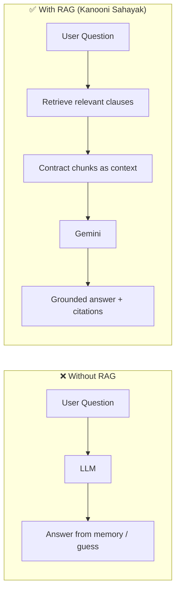
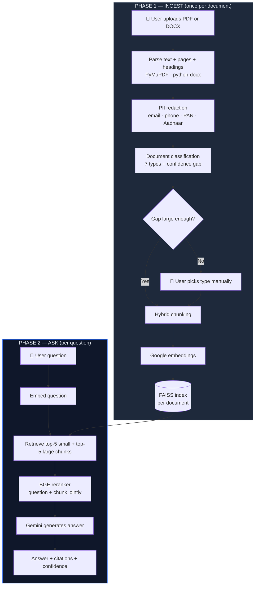
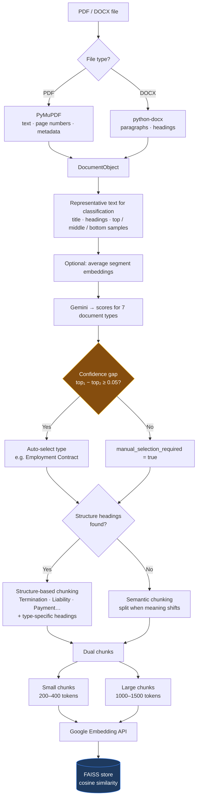
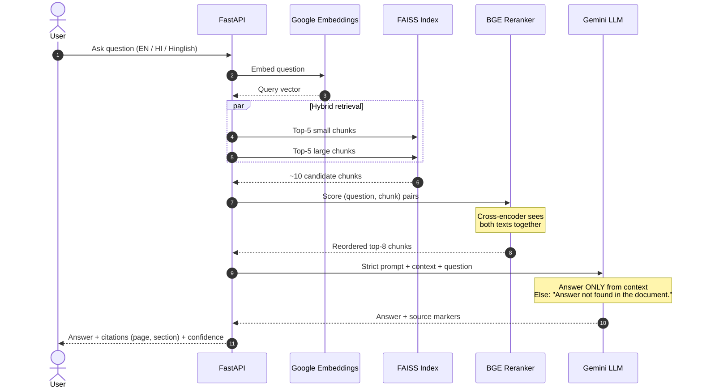
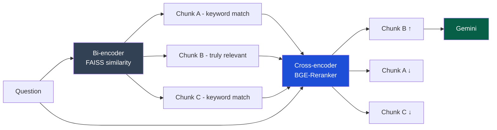
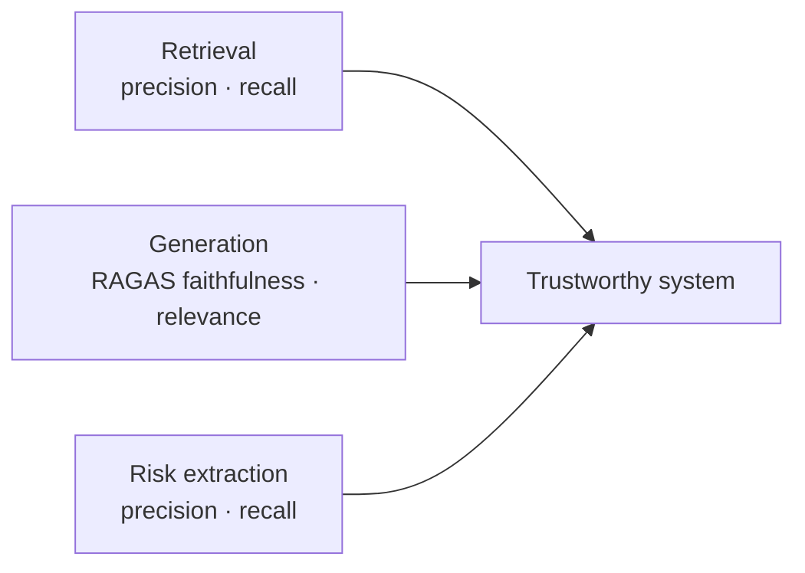

<p align="center">
  <h1 align="center">Kanooni Sahayak</h1>
  <p align="center"><strong>कानूनी सहायक · AI-Powered Legal Contract Assistant</strong></p>
  <p align="center">
    Summarize contracts · Answer questions with citations · Detect risky clauses · English / Hindi / Hinglish
  </p>
</p>

<p align="center">
  <a href="#-what-is-this-project">Overview</a> ·
  <a href="#-what-is-rag">RAG Explained</a> ·
  <a href="#-system-flowcharts">Flowcharts</a> ·
  <a href="#-features">Features</a> ·
  <a href="#-quick-start">Quick Start</a> ·
  <a href="#-interview-guide">Interview Guide</a>
</p>

---

> **For interviewers & demos:** This README walks through the full system design.  
> **Live proof:** `GET /api/features/` · Per-document pipeline: `GET /api/documents/{id}/pipeline`  
> **Checklist:** [FEATURES_VERIFICATION.md](./FEATURES_VERIFICATION.md)  
> **Read code aloud (line by line):** [CODE_READ_ALOUD.md](./CODE_READ_ALOUD.md)

> ⚠️ **Not legal advice.** Kanooni Sahayak assists document review; always verify against source contracts and qualified counsel.

---

## Table of Contents

1. [What is this project?](#-what-is-this-project)
2. [What is RAG?](#-what-is-rag-retrieval-augmented-generation)
3. [System flowcharts](#-system-flowcharts)
4. [Features](#-features)
5. [Pipeline stages (detailed)](#-pipeline-stages-detailed)
6. [Tech stack](#-tech-stack)
7. [Project structure](#-project-structure)
8. [Quick start](#-quick-start)
9. [API reference](#-api-reference)
10. [Evaluation & metrics](#-evaluation--metrics)
11. [Interview guide](#-interview-guide)
12. [Disclaimer](#-disclaimer)

---

## 🎯 What is this project?

**Kanooni Sahayak** is an **AI legal helper** for lawyers, paralegals, and business users who need to **understand legal contracts quickly** without reading every page line-by-line.

| Capability | What the user gets |
|------------|-------------------|
| **Contract summarization** | Executive summary, obligations, dates, payment & termination terms, risks |
| **Question & answering** | Chat over the contract — answers grounded in the document with **page citations** |
| **Risky clause extraction** | Known risks (from legal frameworks) + open-ended discovery — severity **High / Medium / Low** |
| **Multilingual** | English, Hindi, Hinglish (e.g. Hindi question on English contract) |
| **Evaluation** | RAGAS metrics + precision/recall on a validation set |

**How it differs from a generic ChatGPT upload:**  
We do **not** paste the whole contract into the model for every question. We use a **Retrieval-Augmented Generation (RAG)** pipeline: find the right clauses first, then generate — which reduces hallucination and adds traceability.

---

## 🧠 What is Retrieval-Augmented Generation?

### Simple definition

> **Instead of using the LLM to answer only from its training data**, we **first retrieve relevant information from a knowledge base** (the uploaded contract), **then provide that information to the LLM** to generate the answer.

### Without RAG vs With RAG



### Why this matters for legal documents

| Problem | How RAG helps |
|---------|----------------|
| Hallucinated clauses | Model must use retrieved text |
| Long 50+ page contracts | Only relevant sections sent per query |
| Trust & audit | Citations link answers to **page / section** |
| Cost & speed | Smaller prompts = lower latency & API cost |

---

## 📊 System flowcharts

### 1) Big picture — two phases: **Ingest** then **Ask**

When a user uploads a contract, we **index** it once. Each question reuses that index — we never re-send the full PDF to Gemini.



---

### 2) Ingestion pipeline — step by step



**Why we chunk instead of sending the whole document to Gemini**

| Reason | Explanation |
|--------|-------------|
| **Token limits** | Legal documents can be very large; LLMs have context window limits |
| **Cost & latency** | Full-document prompts every query are expensive and slow |
| **Noise reduction** | Only relevant clauses should reach the model |
| **Retrieval precision** | Smaller, well-bound chunks improve search quality |

**Rejected approach:** fixed-size-only chunking (e.g. always 10,000 characters) — clause lengths vary; fixed splits break mid-sentence.

---

### 3) Question-answering (RAG) pipeline



---

### 4) Retrieval: why FAISS + reranking?

Bi-encoders (FAISS) are fast but can retrieve chunks that **share keywords** but are **not legally relevant**. We add a second stage.



| Stage | Model | Speed | Accuracy |
|-------|--------|-------|----------|
| **Retrieve** | FAISS + Google embeddings | Very fast | Good recall |
| **Rerank** | BGE-Reranker (BERT-style) | Slower | High precision |
| **Generate** | Gemini | Medium | Grounded answer |

**Why BGE over MiniLM?** Legal retrieval prioritizes **correctness** over a few milliseconds of latency.

---

### 5) Risky clause extraction

```mermaid
flowchart TD
    DOC[Classified document] --> FW{Load JSON framework}
    FW -->|Employment| E1[employment.json]
    FW -->|Lease / Rental| E2[lease.json]
    FW -->|NDA| E3[nda.json]
    FW -->|Vendor| E4[vendor.json]
    FW -->|Service| E5[service.json]
    FW -->|Unknown| E6[general.json]

    E1 --> FX[Framework-guided extraction<br/>termination · liability · non-compete…]
    E2 --> FX
    E3 --> FX
    E4 --> FX
    E5 --> FX
    E6 --> FX

    FX --> OE[Open-ended discovery<br/>financial · legal · operational · restrictive]
    OE --> DED[Deduplicate by clause text]
    DED --> OUT[List of risks<br/>severity: Low | Medium | High<br/>+ page / section citation]

    style OUT fill:#7f1d1d,stroke:#ef4444,color:#fff
```

**Recall > precision for risks:** Missing a risky clause is worse than over-flagging one.

---

### 6) ASCII overview (if Mermaid does not render)

```
┌─────────────────────────────────────────────────────────────────────────────┐
│                        KANOONI SAHAYAK — END TO END                         │
└─────────────────────────────────────────────────────────────────────────────┘

  UPLOAD                    INDEX (once)                      ASK (many times)
  ──────                    ────────────                      ────────────────

  PDF/DOCX  ──► Parse ──► Classify ──► Chunk ──► Embed ──► FAISS
                  │           │          │                    │
                  │           │          ├── small 200-400    │
                  │           │          └── large 1000-1500  │
                  │           │                               │
                  │      [low confidence?]                    │
                  │           └──► user picks type            │
                  │                                         │
                  └─────────────────────────────────────────┼──► Question
                                                            │
                                                            ▼
                                              Retrieve 5+5 chunks
                                                            │
                                                            ▼
                                              BGE Rerank (top 8)
                                                            │
                                                            ▼
                                              Gemini + citations
```

---

## ✨ Features

| # | Feature | Status | Key files |
|---|---------|--------|-----------|
| 1 | Document ingestion (PDF, DOCX) | ✅ | `services/parsers/` |
| 2 | Document classification + confidence gap | ✅ | `document_classifier.py` |
| 3 | Hybrid chunking (structure → semantic fallback) | ✅ | `services/chunking/` |
| 4 | Google embeddings (batched, cached) | ✅ | `embedding_service.py` |
| 5 | FAISS vector index (cosine, local) | ✅ | `vector_store.py` |
| 6 | Hybrid retrieval + BGE rerank | ✅ | `retriever.py`, `reranker.py` |
| 7 | RAG Q&A + citations | ✅ | `rag_pipeline.py` |
| 8 | Contract summarization (7 sections) | ✅ | `summarizer.py` |
| 9 | Risk extraction (framework + open-ended) | ✅ | `risk_analyzer.py` |
| 10 | Multilingual (EN / HI / Hinglish) | ✅ | `utils/language.py` |
| 11 | RAGAS + risk P/R evaluation | ✅ | `evaluation/` |
| 12 | JWT, PII redaction, TTL cleanup | ✅ | `utils/security.py`, `pii_redaction.py` |

---

## 🔬 Pipeline stages (detailed)

### Document classification

- **Types:** Employment, Lease, Rental, NDA, Vendor, Service, General Legal  
- **Input:** Representative excerpt (not only first 5,000 characters) + optional mean embedding  
- **Confidence gap:** If `score(top₁) − score(top₂) < 0.05` → ask user to select type manually  

```text
Example:
  Employment = 0.82,  Lease = 0.79  →  gap = 0.03  →  manual selection
  Employment = 0.91,  Lease = 0.52  →  gap = 0.39  →  auto-select Employment
```

### Chunking strategy

| Strategy | When | Token sizes |
|----------|------|-------------|
| Structure-based | Headings detected | Per section, capped at small/large windows |
| Semantic | No clear structure | Split on meaning shift |
| **Both sizes stored** | Always | Small **200–400** · Large **1000–1500** |

Classification also adds **type-specific headings** (e.g. “Probation” for employment, “Rent” for lease).

### Embeddings & FAISS

- **Embeddings:** Google `text-embedding-004` — multilingual tradeoff vs Legal-BERT  
- **FAISS:** Free, local, no third-party vector API — **privacy-friendly**  
- **Metric:** Cosine similarity (L2-normalized inner product)  

### Generation rules

- Answer **only** from retrieved context  
- If not found: **`Answer not found in the document.`**  
- Citations: **page → clause → section → character offset**  

---

## 🛠 Tech stack

| Layer | Technologies |
|-------|----------------|
| **Backend** | Python 3.11+, FastAPI, Pydantic, SQLAlchemy (async) |
| **AI** | Google Gemini, Google Embeddings, LangChain |
| **Retrieval** | FAISS, BGE-Reranker (`sentence-transformers`) |
| **Parsing** | PyMuPDF, python-docx |
| **Database** | SQLite → PostgreSQL-ready |
| **Frontend** | React 18, Vite, TailwindCSS, Axios, React Router |
| **Auth** | JWT (access + refresh) |
| **Evaluation** | RAGAS |

---

## 📁 Project structure

```
kanooni-sahayak/
├── README.md                          ← You are here
├── FEATURES_VERIFICATION.md           ← Interview checklist
├── backend/
│   ├── app/
│   │   ├── api/                       # REST: auth, documents, qa, risks, evaluation
│   │   ├── services/
│   │   │   ├── parsers/               # pdf_parser.py, docx_parser.py
│   │   │   ├── chunking/              # structure, semantic, hybrid
│   │   │   ├── embedding_service.py
│   │   │   ├── vector_store.py        # FAISS
│   │   │   ├── retriever.py           # 5 small + 5 large
│   │   │   ├── reranker.py            # BGE cross-encoder
│   │   │   ├── rag_pipeline.py
│   │   │   ├── summarizer.py
│   │   │   ├── risk_analyzer.py
│   │   │   └── document_classifier.py
│   │   ├── risk_frameworks/           # employment.json, lease.json, …
│   │   ├── evaluation/                # RAGAS + risk metrics
│   │   └── prompts/
│   └── run.py
└── frontend/src/
    ├── pages/                         # Login, Dashboard, Upload, Chat, Risks, …
    └── services/api.js
```

---

## 🚀 Quick start

### Prerequisites

- Python 3.11+
- Node.js 18+
- [Google AI API key](https://aistudio.google.com/apikey)

### 1. Backend

```bash
cd kanooni-sahayak/backend
python -m venv .venv

# Windows
.venv\Scripts\activate

pip install -r requirements.txt
copy .env.example .env
```

Edit `.env`:

```env
GOOGLE_API_KEY=your_key_here
SECRET_KEY=your-random-secret
```

```bash
python run.py
```

- API: http://localhost:8000  
- Swagger: http://localhost:8000/docs  
- Feature list: http://localhost:8000/api/features/

### 2. Frontend

```bash
cd kanooni-sahayak/frontend
npm install
npm run dev
```

- App: http://localhost:5173  

### 3. Demo flow (5 minutes)

1. **Register** → **Login**  
2. **Upload** a contract (PDF or DOCX)  
3. Open **Pipeline** on the document — verify checklist ✅  
4. **Chat** — ask *“What is the notice period?”* → see citations  
5. **Risks** — framework + open-ended risks with severity  
6. **Summary** — switch English / Hindi  
7. **Evaluation** — run RAGAS on sample questions  

---

## 📡 API reference

| Group | Endpoint | Description |
|-------|----------|-------------|
| **Features** | `GET /api/features/` | All implemented capabilities |
| **Auth** | `POST /api/auth/register`, `/login` | JWT tokens |
| **Documents** | `POST /api/documents/upload` | Ingest + index |
| **Documents** | `GET /api/documents/{id}/pipeline` | Pipeline metadata for demos |
| **Summaries** | `POST /api/summaries/generate` | 7-section summary |
| **Q&A** | `POST /api/qa/ask` | RAG answer + citations |
| **Risks** | `POST /api/risks/analyze/{id}` | Risk list + severity |
| **Evaluation** | `POST /api/evaluation/run` | RAGAS metrics |
| **Evaluation** | `GET /api/evaluation/benchmarks` | Reference validation scores |

---

## 📈 Evaluation & metrics

Evaluated at **three levels:**



| Level | Metrics | How |
|-------|---------|-----|
| **Retrieval** | Precision, recall | ~30 docs, manual Q → expected clause |
| **Generation** | Faithfulness, answer relevance | RAGAS |
| **Risk** | Precision ~88%, recall ~84% | ~20 contracts, manual labels |

**RAGAS** (Retrieval Augmented Generation Assessment): for each test case, provide `question`, `retrieved_contexts`, `answer` → scores faithfulness & relevance.

**Sample results (internal validation — not legal-expert certified):**

| Metric | Score |
|--------|-------|
| RAGAS faithfulness | ~92% |
| RAGAS answer relevance | ~90% |
| Risk precision | ~88% |
| Risk recall | ~84% |

Chunk sizes (200–400 / 1000–1500) validated via RAGAS grid search on 20–30 questions per document type.

---

## 🎤 Interview guide

### 30-second pitch

> *"Kanooni Sahayak is an AI legal assistant that helps users understand contracts. Instead of asking Gemini to read an entire 50-page PDF every time, we use RAG: chunk the contract, store embeddings in FAISS, retrieve the top relevant clauses per question, rerank with BGE, and only then generate an answer with page citations. We also classify document type for better chunking and risk frameworks, extract risky clauses using JSON templates plus open-ended discovery, and evaluate with RAGAS on a 30-document validation set."*

### Common questions → short answers

| Question | Answer |
|----------|--------|
| What is RAG? | Retrieve relevant clauses first, then generate — not from memory alone |
| Why not send full doc to Gemini? | Token limits, cost, latency, noise |
| Why FAISS not Pinecone? | Free, local, private — no vector data leaves the machine |
| Why rerank after FAISS? | Keyword similarity ≠ legal relevance; cross-encoder scores Q+chunk together |
| Why Google embeddings not Legal-BERT? | Multilingual tradeoff; single stack with Gemini |
| Answer not in document? | Prompt returns exact: *"Answer not found in the document."* |
| How cite sources? | Page → clause → section → char offset from parser metadata |
| Risk recall vs precision? | **Recall matters more** — missing a bad clause is worse than over-flagging |

### What NOT to demo

| ❌ Avoid | ✅ Use instead |
|----------|----------------|
| `legalDocumentAssistant/app.py` (Streamlit) | `kanooni-sahayak/` full stack |
| Saying "ChatGPT wrapper" | Walk the ingestion + RAG flowcharts above |

---

## ⚖️ Disclaimer

Kanooni Sahayak is an **assistive document-understanding tool**. It does **not** provide legal advice, does not create an attorney-client relationship, and must not replace review by qualified legal professionals. Outputs may contain errors; always verify against the original contract.

---

<p align="center">
  <strong>Kanooni Sahayak</strong> — Understand contracts faster. Ground every answer in the document.
</p>
